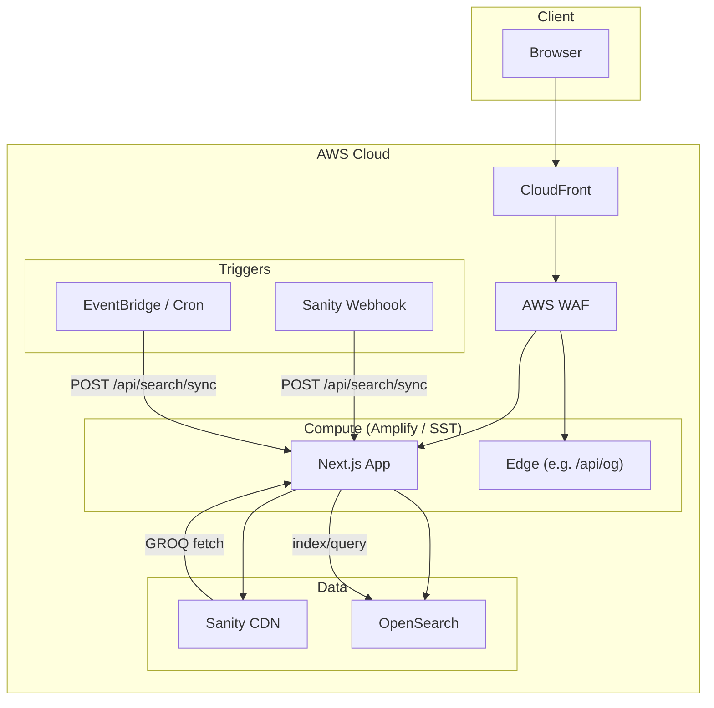

# AWS Architecture for Sanity + Next.js

This document describes how to deploy this Next.js 16 application to AWS with CDN and firewall protection.

---

## 1. Compute — Deploying Next.js 16 on AWS

### Recommendation: **AWS Amplify (Gen 2) or SST (OpenNext)**

**Why not plain Lambda + API Gateway:** Next.js 16 uses the App Router, middleware, ISR, and Edge Runtime. Packaging the full app (including pnpm monorepo and Turborepo build outputs) into a single Lambda is brittle and has size/timeout limits. You need a framework that understands Next.js.

**Why Amplify Gen 2 or SST:**

- **Next.js 16 support:** Both use the Open Next build (or equivalent) to split server/serverless/edge and static assets correctly.
- **Monorepo:** Amplify and SST support building from a subdirectory (e.g. `apps/web`) and resolving workspace dependencies. Turborepo can run as the build command (`pnpm run build` with `--filter=web`), producing a `.next` output that is then deployed.
- **pnpm:** Both support pnpm; Amplify Gen 2 and SST can be configured to use `corepack enable pnpm` and `pnpm install --frozen-lockfile` in the build image.
- **Edge Runtime:** The `/api/og` route uses Edge Runtime. Amplify and SST deploy Edge functions to CloudFront or Lambda@Edge so that route stays on the edge; the rest of the app runs in Node Lambda or container.

**Alternative: ECS/Fargate with a Node server**

- Run `next start` in a container behind an Application Load Balancer. This avoids Lambda limits and supports long-running connections, but you lose automatic scaling per-request and pay for always-on capacity. Suitable for high, steady traffic or when you need sticky sessions.

**Summary:** Use **SST (OpenNext)** or **Amplify Gen 2** for a production deployment that respects Next.js 16, pnpm, and Turborepo, with Edge for `/api/og` and serverless for the rest.

---

## 2. CDN — CloudFront Configuration

Put CloudFront in front of the compute origin (Amplify/SST already provision this). Define cache behaviours as follows.

| Behaviour        | Path pattern     | Origin           | TTL (min) | Justification |
|-----------------|------------------|------------------|-----------|---------------|
| Static assets   | `/_next/static/*` | S3 or build output | 31,536,000 (1 year) | Hashed filenames; immutable. Max cache. |
| Images          | `/images/*`      | Same             | 86,400 (1 day) | Sanity CDN or app images; 24h balances freshness and cost. |
| API routes      | `/api/*`         | Lambda/Origin    | 0         | Search, sync, OG — always dynamic. No cache. |
| OG / dynamic    | `/api/og`        | Edge/Lambda      | 0         | Per-request image generation. |
| ISR / blog      | `/blog`, `/blog/*` | Lambda/Origin  | 60        | Blog list/detail: short TTL so new posts appear within a minute. |
| Pokedex         | `/pokedex`, `/pokedex/*` | Lambda/Origin | 300      | Data from PokeAPI; 5 min ISR is acceptable. |
| Default         | `*`              | Lambda/Origin    | 60        | HTML pages; short TTL for content updates. |

**Cache key:** Include `Host` and normalize `Accept-Encoding`. For static, use `_next/static/*` with no cookies/query. For HTML, include `Accept: text/html` in the key if you vary by user-agent for A/B tests.

**Invalidation:** On publish from Sanity, call the sync webhook (which may trigger a small CloudFront invalidation for `/blog*` and `/`) or rely on the short TTLs above so that ISR and revalidation handle freshness.

---

## 3. WAF — Rules on CloudFront

Attach an AWS WAF web ACL to the CloudFront distribution.

### 3.1 Rate limiting on API routes

- **Rule:** Scope a rate-based rule to requests matching path `/api/*`.
- **Threshold:** 2,000 requests per 5 minutes per IP (configurable per environment).
- **Action:** Block for the remainder of the 5-minute window.
- **Trade-off:** Too low (e.g. 100/5min) and legitimate power users or small teams hit the block; too high and abuse (scraping, DoS) is not mitigated. 2,000/5min ≈ 6.6 req/s per IP, which allows normal search and sync usage while limiting brute force.

### 3.2 SQL injection and XSS

- **Managed rule groups:** Use **AWSManagedRulesKnownBadInputsRuleSet** (covers common bad inputs) and **AWSManagedRulesSQLiRuleSet** (SQL injection). For XSS, use **AWSManagedRulesAmazonIpReputationList** in combination with **AWSManagedRulesCommonRuleSet** (includes XSS and other OWASP-style rules).
- **Scope:** Apply to the whole distribution; the rule sets are designed for general web traffic.

### 3.3 Additional rule — Bot control

- **Rule:** Enable **AWSManagedRulesBotControlRuleSet** (if available for your region and WAF tier).
- **Purpose:** Reduces scraping and automated abuse on public pages and API. For an agency site, this protects content and keeps analytics meaningful.

**Alternative:** Geo-blocking (e.g. allow only certain countries) or IP reputation list only, if bot control is not required.

---

## 4. Data flow — Sanity → Search index → User

1. **Content creation:** Editors publish/update/delete in Sanity Studio.
2. **Indexing:** A **repeatable pipeline** keeps OpenSearch in sync:
   - **Option A (recommended):** Sanity webhook on publish/update/delete calls `POST /api/search/sync` (with `SEARCH_SYNC_SECRET`). The route runs the sync job (fetch published blogs from Sanity, write to OpenSearch).
   - **Option B:** A scheduled job (e.g. EventBridge + Lambda or cron in the same app) calls `POST /api/search/sync` every 5–15 minutes.
3. **OpenSearch:** Can run on AWS OpenSearch Service (managed) or self-hosted. Index name from `OPENSEARCH_INDEX`; documents have a `type` field (`blog`, `pokedex`).
4. **Caching at each layer:**
   - **Sanity:** CDN and Sanity's own caching; we use the read token and published perspective.
   - **OpenSearch:** No application-level cache; search is always against the index. OpenSearch Service has its own caching.
   - **Next.js:** ISR for `/blog` and `/blog/[slug]`; revalidate 60–300 as above. API routes (`/api/search`, `/api/search/sync`) are dynamic (no cache).
5. **Stale content:** After a publish, the webhook (or next cron run) triggers sync; OpenSearch is updated. Blog listing and detail pages revalidate on the next request (ISR) or on time-based revalidation, so users see new content within the configured TTL. Optional: trigger On-Demand Revalidate for `/blog` and the changed `/blog/[slug]` when sync completes.

---

## 5. Architecture diagram

**Request flow (user search):** Browser → CloudFront → WAF → Next.js (Lambda) → OpenSearch → response. No caching for `/api/search`.

**Request flow (content publish):** Sanity → Webhook → Next.js `/api/search/sync` → Sanity fetch + OpenSearch bulk index. Optionally trigger revalidation for `/blog`.

---

## Summary

| Area      | Choice |
|----------|--------|
| Compute  | SST (OpenNext) or Amplify Gen 2 for Next.js 16, pnpm, Turborepo; Edge for `/api/og`. |
| CDN      | CloudFront with behaviours for static (long TTL), API (no cache), blog/pokedex (short TTL/ISR). |
| WAF      | Rate limit on `/api/*`; AWS managed rule sets for SQLi/XSS and common rules; bot control or geo/IP as extra. |
| Data flow| Sanity → webhook or cron → `/api/search/sync` → OpenSearch; ISR and optional on-demand revalidation for freshness. |
